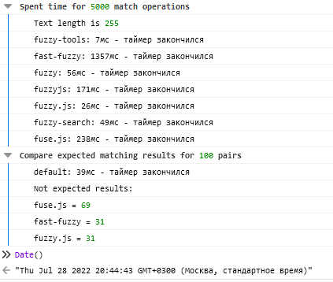

# fuzzy-tools

1. [What is it?](#what-is-it)
2. [Live example](https://codesandbox.io/s/fuzzytoolsexample-4r2ej)
3. [Installation](#installation)
4. [What is new?](#what-is-new)
5. [Match function](#match-function)
    - [Match in string](#match-in-string)
    - [Match in list of strings](#match-in-list-of-strings)
6. [Filter function](#filter-function)
    - [Filter strings list](#filter-strings-list)
    - [Filter objects list](#filter-objects-list)
7. [Benchmark results](#benchmark-results)
8. [Tests](./tests)


## What is it?

It is [**the fastest**](#benchmark-results) functions for fuzzy matching and items filtering.


https://codesandbox.io/s/fuzzytoolsexample-4r2ej

## Installation

```
npm install --save fuzzy-tools
```

## What is new?
v.2.0.0
  - `caseInsensitive` removed (use `caseSensitive: true` instead of `caseInsensitive: false`)
  - `mask` not only `String`, but `Array.of(String)`. In case when it is array then search will be work as fuzzy but not by chars, but by words.
    `['fuz', 'sea']` will not be found in `fuuuuzzzzzy seeeeearch`, but will be found in `fuzzzzzy search`.

## Match function

`match(mask, where, options):Object` - returns result of string matching. Returns object if `mask` matches `where` (e.g. 'fzz' in 'fuzzy'), null - if it is not ('fzza' in 'fuzzy').

#### [Tests cases for match](./tests/match)

#### [Tests cases for matchList](./tests/matchList)

#### [Tests cases for matchString](./tests/matchString)

### **Arguments**
| args | type | default | note |
| - | - | - | - |
| mask | string or array.of(string) | no | provide what you want to find ('fzz' or ['fuz', 'sea']) |
| where | string or array | no | destination string or array of strings |
| options | object | {...} | additional options |
|  |  |  |  |

- `mask`
    - *String*: 'fzz' will be found in 'fuzzy search'
    - *Array.of(String)*:

      ['fzz'] will NOT be found in 'fuzzy search'.

      ['fuz', 'sea'] will be found in 'fuzzy search'.

      ['fuz', 'seaa'] will NOT be found in 'fuzzy search', because ALL words should be in `where`.

      ```js
        match('fzz', 'fuzzy search'); // { score: 1 }
        match(['fzz'], 'fuzzy search'); // null
        match(['fuz', 'rch'], 'fuzzy search'); // { score: 1 }
        match(['fuz', 'rch1111'], 'fuzzy search'); // null
      ```
- `where`
    - *String*: result contains `score` is score of matching.
      ```js
        match('fuz', 'fuzzy'); // { score: 1 }
      ```
    - *Array of strings* or *Object({ key: String, key2: String })*: result contains `score` is min of scores of each string (score = min(match(mask, item[0]), match(mask, item[1]), ...)).
      ```js
        match('fuz', ['fuzzy', 'it is fuzzy']);
        // { score: 1, matches: { 0: { score: 1 }, 1: { score: 1 } } }
        match('fuz', { v1: 'fuzzy', v2: 'it is fuzzy' });
        // { score: 1, matches: { v1: { score: 1 }, v2: { score: 1 } } }
      ```
    - *Array of Object({ value: String, rate: Number(>0 and <=1) })*: result contains `score` is min of score of each value * rate (score = min(match(mask, item[0].value) / item[0].rate, ...))
      ```js
        match('fuz',
          [
            { value: 'fuzzy', rate: 0.75 },
            { value: 'it is fuzzy', rate: 0.25 }
          ]
        );
        match('fuz',
          {
            v1: { value: 'fuzzy', rate: 0.75 },
            v2: { value: 'it is fuzzy', rate: 0.25 }
          }
        )
      ```
- `options`
    - `caseSensitive`: Boolean (default: false) - when it is true, then `FZZ` will not be matched with `fuzzy`. Char's case will be ignored.
    - `withScore`: Boolean (default: false) - when it is true, then `score` will be computed for matched strings, else `score` will be 1.
    - `withWrapper`: String or Function (default: false) - when it is true, then result will contains `wrapped`. It is needed to render highlighted results.
        - *String*: template string, (e.g. `'<b>{?}</b>'`, `{?}` will be replaced by matched word. `fzz` in `fuzzy` => `'<b>f</b>u<b>zz</b>y'`.
        - *Function(word: String): String*, (e.g. `(word) => '<b>'+word+'</b>'`)
    - `withRanges`: Boolean (default: false) - when it is true, then result will contains `ranges`. It is array of Object({ begin: Number, end: Number }) with ranges of matched parts.
    - `rates`: or(Array, Object) of rates (> 0 and <= 1).
      ```js
        match('fuz',
          ['fuzzy', 'it is fuzzy'],
          { rates: [0.75, 0.25] }
        )
        // or
        match('fuz',
          ['fuzzy', 'it is fuzzy'],
          { rates: { 0: 0.75, 1: 0.25 } }
        )
        // the same that
        match('fuz',
          {
            v1: { value: 'fuzzy', rate: 0.75 },
            v2: { value: 'it is fuzzy', rate: 0.25 }
          }
        )
      ```

### **Result**

- `score` - from `0.001` to `infinity`, less is better. If `withScore` is false then `score` is `1` always.

- `matches` - It will be if `where` is *Array* or *Object*. It is object with results, *key* is index or key, value is *Object*
  ```js
      {
        score: Number,
        original: String,
        index: or(Number, String),
        [wrapped: String],
        [ranges: Array]
      }

  ```

- `wrapped` - contains wrapped original string or result of `withWrapper` function. It is undefined if `withWrapper` is false.

- `ranges` - array with matched ranges `{ begin: Number, end: Number }`. It is undefined if `withRanges` is false.

```javascript
import { match } from 'fuzzy-tools';

match('fzz', 'fuzzy', { withScore: true }); // { score: 1.74 }

match('fzz', ['fu', 'fuzza'], { withScore: true }) // { score: 1.74, matches: {1:{score: 1.74}} }

match('fzz', [{ value: 'fuzza', rate: 0.75 }, { value: 'fuzzy', rate: 0.10 }], { withScore: true })
// { score: 2.32, matches: {0: {score: 2.32}, 1: {score: 17.4}} }
// score = Min(1.74 / 0.75, 1.74 / 0.10)

match('fzz', 'fuzzy'); // { score: 1 }

match('fZZ', 'fuzzy', { caseSensitive: true }); // null

match('fZZ', 'fuzzy', { withWrapper: '<i>{?}</i>' });
// { score: 1, wrapped: '<i>f</i>u<i>zz</i>y' }

match('fZZ', ['fuzzy'], { withWrapper: '<i>{?}</i>' });
// { score: 1, matches: {0: {score: 1, original: 'fuzzy', index: 0, wrapped: '<i>f</i>u<i>zz</i>y', original: 'fuzzy'}}}

match('fZZ', { v: 'fuzzy' }, { withWrapper: '<i>{?}</i>' });
// { score: 1, matches: { v: {score: 1, original: 'fuzzy', index: 'v', wrapped: '<i>f</i>u<i>zz</i>y', original: 'fuzzy'}}}

match('fZZ', 'fuzzy', { withWrapper: w => `<b>${w}</b>` });
// { score: 1, wrapped: '<b>f</b>u<b>zz</b>y' }

match('fZZ', ['fuzzy'], { withWrapper: w => `<b>${w}</b>`, withScore: true });
// { score: 1, matches: {0: {score: 1, wrapped: '<b>f</b>u<b>zz</b>y', original: 'fuzzy'}}}

match('fZZ', 'fuzzy', { withRanges: true });
// { score: 1, ranges: [{begin: 0, end: 0}, {begin: 2, end: 3}]}

match('fZZ', ['fuzzy'], { withRanges: true });
// { score: 1, matches: {0: {score: 1, ranges: [{begin: 0, end: 0}, {begin: 2, end: 3}], original: 'fuzzy'}}}
```

### Match in string

```javascript
import { match } from 'fuzzy-tools';
// or
// import { matchString } from 'fuzzy-tools';

match('fzz', 'fuzzy', { withScore: true }); // { score: 1.74 }

match('fzz', 'fuzzy'); // { score: 1 }

match('fZZ', 'fuzzy', { caseSensitive: true }); // null

match('fZZ', 'fuzzy', { withWrapper: '<i>{?}</i>', withScore: true });
// { score: 1.74, wrapped: '<i>f</i>u<i>zz</i>y' }

match('fZZ', 'fuzzy', { withWrapper: w => `<b>${w}</b>` });
// { score: 1, wrapped: '<b>f</b>u<b>zz</b>y' }

match('fZZ', 'fuzzy', { withRanges: true });
// { score: 1, ranges: [{begin: 0, end: 0}, {begin: 2, end: 3}]}
```

### Match in list of strings
```javascript
import { match } from 'fuzzy-tools';
// or
// import { matchList } from 'fuzzy-tools';

match('fzz', ['fu', 'fuzza'], { withScore: true })
// { score: 1.74, matches: {1: {score: 1.74, original: 'fuzza', index: 1}} }

match('fzz', { v1: 'fu', v2: 'fuzza' })
// { score: 1, matches: {v2: {score: 1, original: 'fuzza', index: 'v2'}} }

match('fzz', [{ value: 'fuzza', rate: 0.75 }, { value: 'fuzzy', rate: 0.10 }], { withScore: true })
// {
//   score: 2.3708148148148145,
//   matches: {
//     0: { score: 2.3708148148148145, original: 'fuzza', rate: 0.75, index: 0 },
//     1: { score: 17.78111111111111, original: 'fuzzy', rate: 0.10, index: 1 }
//   }
// }
// score = min(2.3708148148148145, 17.78111111111111)

// the same but more compact
match('fzz', ['fuzza', 'fuzzy'], { rates: [0.75, 0.10], withScore: true })
// {
//   score: 2.3708148148148145,
//   matches: {
//     0: { score: 2.3708148148148145, original: 'fuzza', rate: 0.75, index: 0 },
//     1: { score: 17.78111111111111, original: 'fuzzy', rate: 0.10, index: 1 }
//   }
// }
// score = min(2.3708148148148145, 17.78111111111111)

match('fzz', {v1: { value: 'fuzza', rate: 0.75 }, v2: { value: 'fuzzy', rate: 0.10 } }, { withScore: true })
// {
//   score: 2.3708148148148145,
//   matches: {
//     v1: { score: 2.3708148148148145, original: 'fuzza', rate: 0.75, index: 'v1' },
//     v2: { score: 17.78111111111111, original: 'fuzzy', rate: 0.10, index: 'v2' }
//   }
// }
// score = min(2.3708148148148145, 17.78111111111111)

// the same but more compact
match('fzz', { v1: 'fuzza', v2: 'fuzzy' }, { rates: { v1: 0.75, v2: 0.10 }, withScore: true })
// {
//   score: 2.3708148148148145,
//   matches: {
//     v1: { score: 2.3708148148148145, original: 'fuzza', rate: 0.75, index: 'v1' },
//     v2: { score: 17.78111111111111, original: 'fuzzy', rate: 0.10, index: 'v2' }
//   }
// }
// score = min(2.3708148148148145, 17.78111111111111)

match('fZZ', ['fuzzy'], { caseSensitive: true });
// null

match('fZZ', ['fuzzy'], { withWrapper: '<i>{?}</i>' });
// { score: 1, matches: {0: {score: 1, index: 0, wrapped: '<i>f</i>u<i>zz</i>y', original: 'fuzzy'}}}

match('fZZ', ['fuzzy'], { withWrapper: w => `<b>${w}</b>`, withScore: true });
// { score: 1.74, matches: {0: {score: 1.74, index: 0, wrapped: '<b>f</b>u<b>zz</b>y', original: 'fuzzy'}}}

match('fZZ', ['fuzzy'], { withRanges: true });
// { score: 1.74, matches: {0: {score: 1.74, index: 0, ranges: [{begin: 0, end: 0}, {begin: 2, end: 3}], original: 'fuzzy'}}}
```

## Filter function
`filter(mask: OR(String, Array.of(String)), items: Array, options: Object): Array` - returns list of matched items.

#### [Tests cases](./tests/filter)

### **Arguments**
| args | type | default | note |
| - | - | - | - |
| mask | string or array.of(string) | no | what you want to find (fzz) |
| items | array | no | items list |
| options | object | {...} | additional options |
|  |  |  |  |

- `mask` - read more in [Match function](#match-function)
- `where`
    - Array of Strings
    - Array of Objects
- `options`
    - `extract`: required to filter Array of Objects
        - *String: field name* - this field will be extrtacted to match with mask
        - *Array: fields names* - these fields will be extrtacted to match with mask, each field will have 1 as rate.
        - *Object: { fieldName: rateNumber }* - field name is key, rate is value.
        - *Function(item):String or Array* - function takes item and should return *String*, *Array of Strings*, *Object of Strings* or *Array of Object({ value: String, rate: Number })*
    - `itemWrapper`: *function(item, matchResult, { index: Number, result: Array }): any* - function takes item and matchResult and should return value that will be pushed into result list. *If it returns empty value (false, null, undefined, '', 0), then it will not be pushed into result.*
    - `caseSensitive`: Boolean (default: false) - when it is true, then `FZZ` will not be matched with `fuzzy`. If it is false then char's case will be ignored.
    - `withScore`: Boolean (default: false) - when it is true, then `score` will be computed for matched strings, else `score` will be 1.
    - `withWrapper`: String or Function (default: false) - when it is true, then match result for each item will contain `wrapped`. It is needed to render highlighted results.
        - **String**: template string, (e.g. `'<b>{?}</b>'`, `{?}` will be replaced by matched word. `fzz` in `fuzzy` => `'<b>f</b>u<b>zz</b>y'`.
        - **Function(word: String): String**, (e.g. `(word) => '<b>'+word+'</b>'`)
    - `withRanges`: Boolean (default: false) - when it is true, then match result for each item will contain `ranges`. It is array of Object({ begin: Number, end: Number }) with ranges of matched parts.

### Filter strings list
```javascript
import { filter } from 'fuzzy-tools';

const data = ['fuzzy', 'fazzy', 'furry', 'funny', 'fuuuuuzzer'];
filter('fZZ', data);
// ['fuzzy', 'fazzy', 'fuuuuuzzer'];

filter('fZZ', data, { itemWrapper: item => item.toUpperCase() });
// ['FUZZY', 'FAZZY', 'FUUUUUZZER'];

filter('fZZ', data, { withWrapper: '<{?}>', itemWrapper: (item, match) => match.wrapped });
// ['<f>u<zz>y', '<f>a<zz>y', '<f>uuuuu<zz>er'];

filter('fZZ', data, { extract: (item) => item.slice(0, 4) });
// ['fuzzy', 'fazzy'];

filter('FZZ', data, { caseSensitive: true });
// [];

filter('FZZ', data, { caseSensitive: true, extract: item => item.toUpperCase() });
// ['fuzzy', 'fazzy', 'fuuuuuzzer'];
```

### Filter objects list
```javascript
import { filter } from 'fuzzy-tools';

const data = [{ v: 'fuzzy' }, { v: 'funny' }, { v: 'fuuuuuzzer'}];

filter('fZZ', data, { extract: 'v' });
// [{ v: 'fuzzy' }, { v: 'fuuuuuzzer'}];

filter('fZZ', data, { extract: 'vvv' });
// [];

filter('fZZ', data, { extract: 'v', itemWrapper: item => item.v });
// ['fuzzy', 'fuuuuuzzer'];

filter('fZZ', data, { extract: 'v', withWrapper: '<{?}>', itemWrapper: (item, m) => m.wrapped });
// ['<f>u<zz>y', '<f>uuuuu<zz>er'];

// if extract contains more than 1 field, then result of matching will contain matches array
filter('fZZ', data, {
    extract: ['v', 'v2'],
    withWrapper: '<{?}>',
    itemWrapper: (item, m) => m.matches[0].wrapped
});
// ['<f>u<zz>y', '<f>uuuuu<zz>er'];
```

## Benchmark results

#### **Compare next libraries**

* fuzzy-tools (this)
* fast-fuzzy (https://www.npmjs.com/package/fast-fuzzy)
* fuzzy (https://www.npmjs.com/package/fuzzy)
* fuzzyjs (https://www.npmjs.com/package/fuzzyjs)
* fuzzy.js (https://www.npmjs.com/package/fuzzy.js)
* fuse.js (https://www.npmjs.com/package/fuse.js)
* fuzzy-search (https://www.npmjs.com/package/fuzzy-search)

#### **Methodology**
1. generate pairs mask (random length) and string (255 or 5000 chars length). 5000 pairs.
2. call match function from each library
3. compare results

#### **Results**

It is more real case - 5000 items with 255 length string


It is test case - 5000 items with 2000 length string. And it is not mistake, it is real results.


#### **Benchmark project**

https://codesandbox.io/s/fuzzytoolsbenchmarkexample-t9fk1?file=/src/index.js
